 

- Adds the ability to craft uncraftable items in Minecraft
- Removes some difficulty to the game

## Current items
- Bell
- Budding Amethyst
- Cobweb
- Calcite
- Enchanted Golden Apple
- Heart of the sea
- Name Tag
- Saddle
- String
- Spore blossom
- Soul soil
- Trident
- Tuff
- Bedrock
- All Saplings
- Ender Pearls
- Command Block
- Nether Star
- Barrier
- Elytra
- Dead Bush
- Totem of Undying

## Planned items
- All Ores
- Horse Armour
- Spawn Eggs
  - Mushroom Block
  - Brown
  - Red

## Recepies

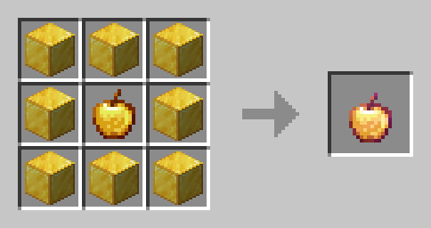
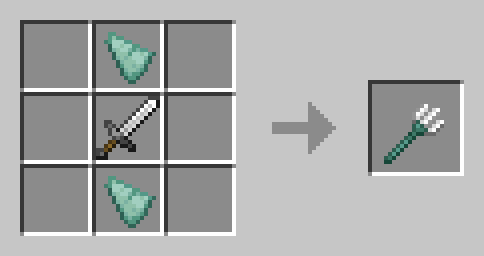
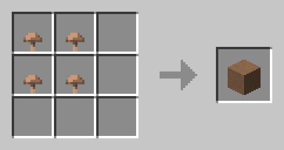
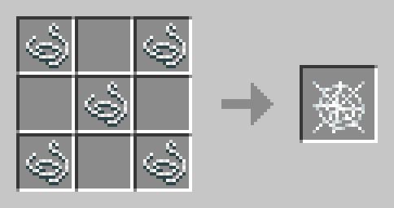
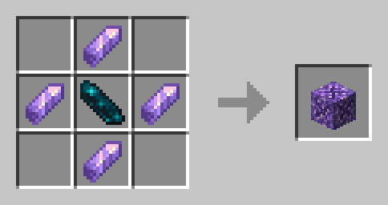
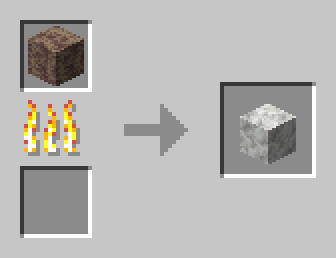
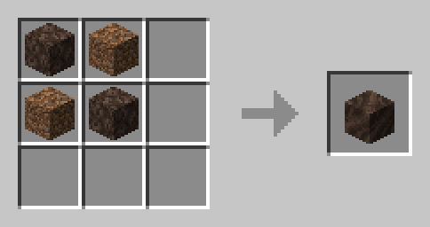
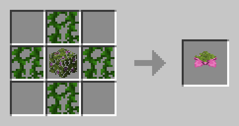
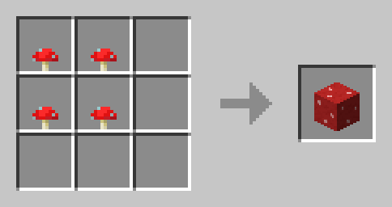
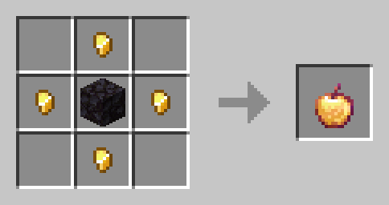
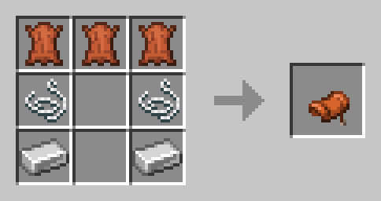
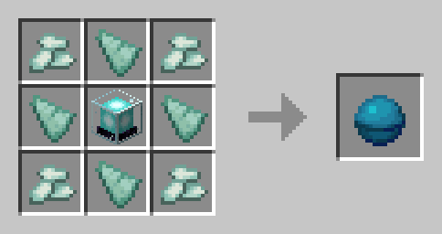
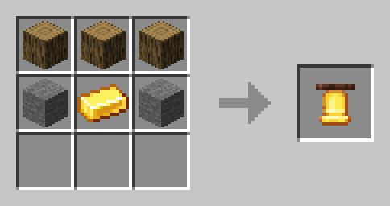
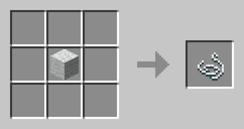
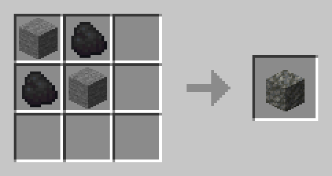
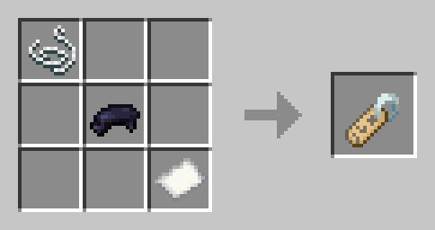