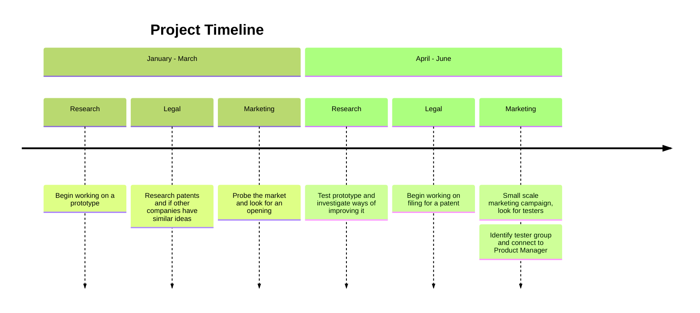
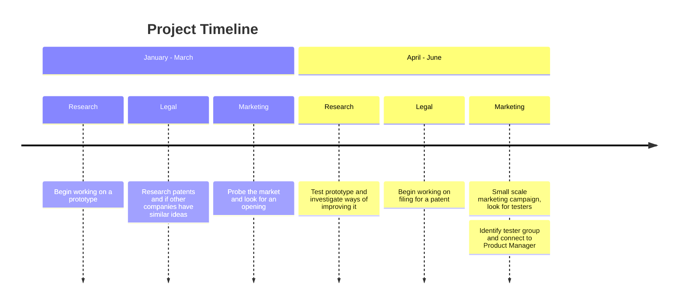

test

```mermaid
%%{init: { 'theme': 'forest' }}%%
timeline
    title Project Timeline
    section January - March
        Research : Begin working on a prototype
        Legal : Research patents and if other companies have similar ideas
        Marketing : Probe the market and look for an opening
    section April - June
        Research : Test prototype and investigate ways of improving it
        Legal : Begin working on filing for a patent
        Marketing : Small scale marketing campaign, look for testers : Identify tester group and connect to Product Manager
```

```mermaid
timeline
    title Project Timeline
    section January - March
        Research : Begin working on a prototype
        Legal : Research patents and if other companies have similar ideas
        Marketing : Probe the market and look for an opening
    section April - June
        Research : Test prototype and investigate ways of improving it
        Legal : Begin working on filing for a patent
        Marketing : Small scale marketing campaign, look for testers : Identify tester group and connect to Product Manager
```